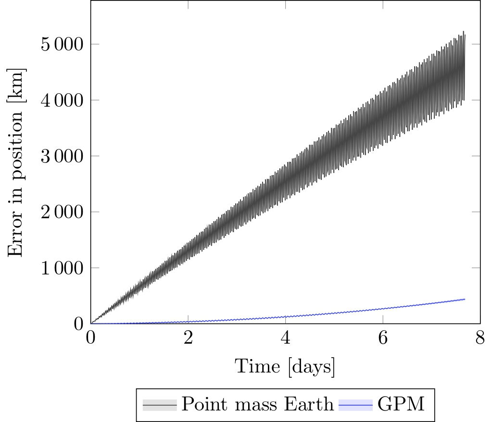
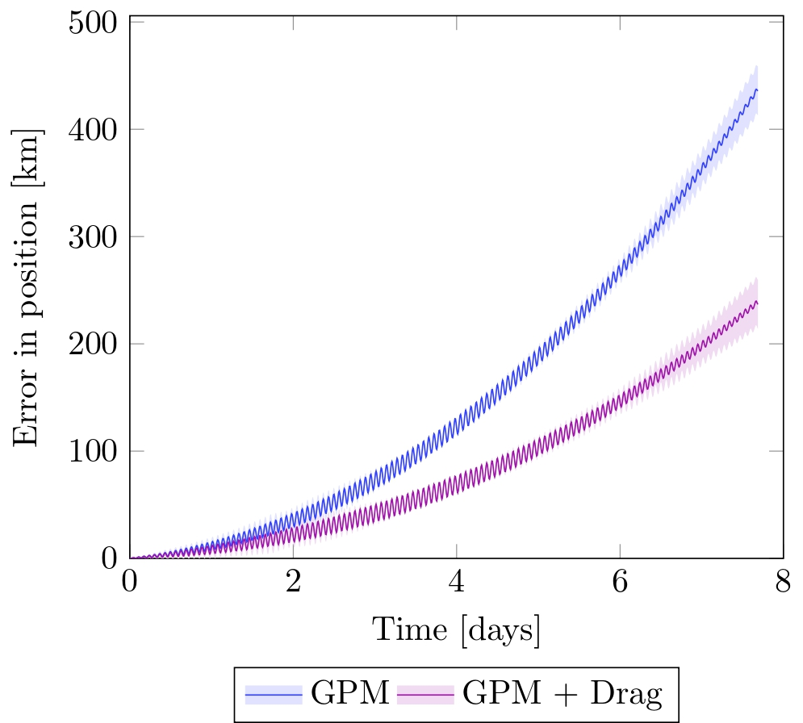
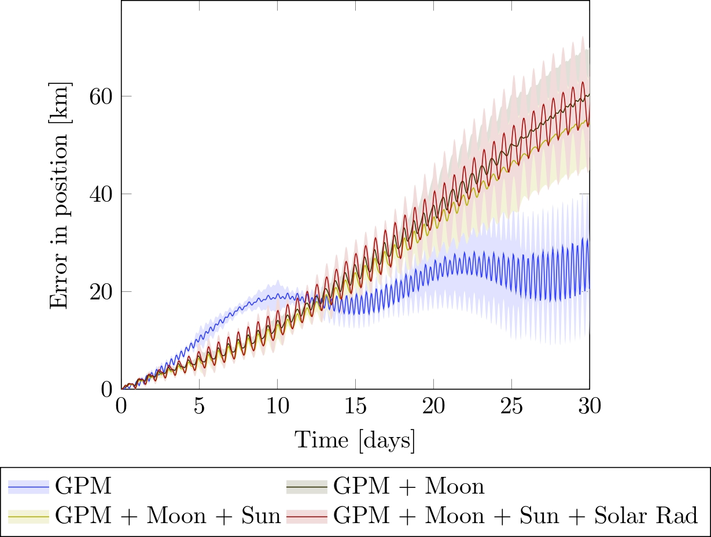
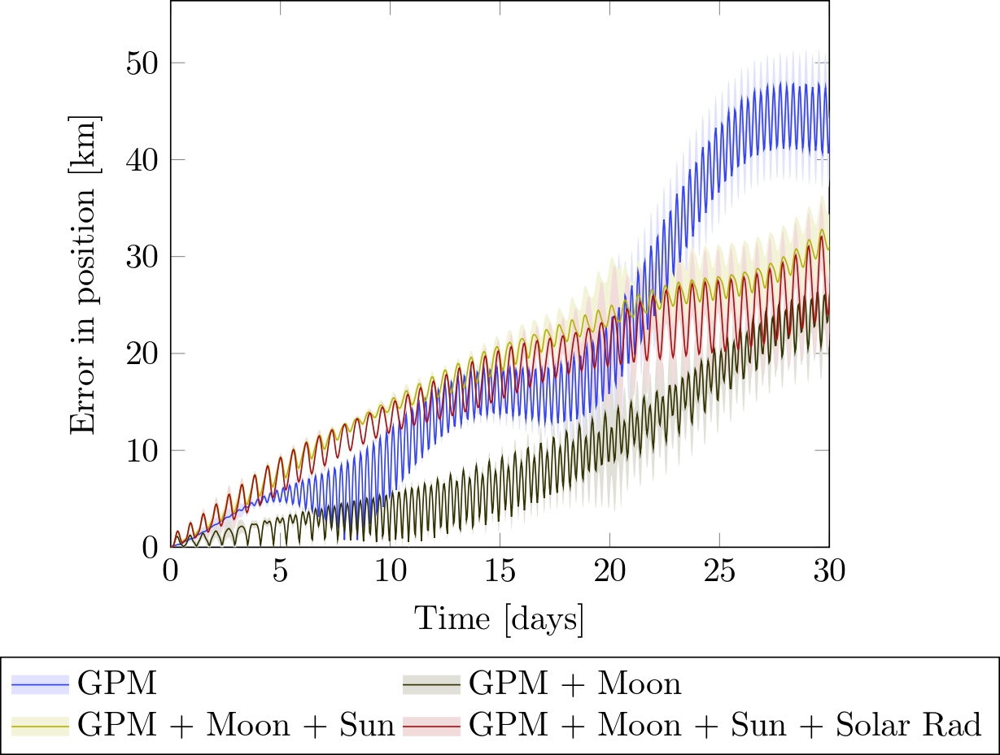
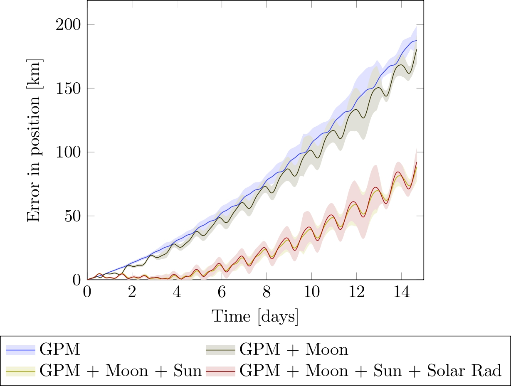

# Numerical propagation of trajectories of Earth-orbiting spacecraft

## Introduction

In this project we compute the compare the errors obtained from propagating the trajectories of different satellites with to models: our model and the SGP4 model. Our model consist in solving the following differential equation:

```math
\begin{cases}
\dot{\mathbf{r}} = \mathbf{v}\\
\dot{\mathbf{v}} = \mathbf{a}_{\mathrm{GP}} + \delta_{\mathrm{sun}}\mathbf{a}_{\mathrm{sun}} + \delta_{\mathrm{moon}}\mathbf{a}_{\mathrm{moon}} + \delta_{\mathrm{drag}}\mathbf{a}_{\mathrm{drag}} +\delta_{\mathrm{rad}}\mathbf{a}_{\mathrm{rad}}
\end{cases}
```

Here, $`\mathbf{a}_{\mathrm{GP}}=(\ddot{x},\ddot{y},\ddot{z})`$ is the acceleration caused by the geopotential (expanded in spherical harmonics) and $\ddot{x}$, $\ddot{y}$ and $\ddot{z}$ are given in [Cunningham recursions](https://github.com/victorballester7/final-bachelor-thesis/blob/dc82b9a0204b01edc024837cc173b822f4e01464/docs/articles/cunningham1970.pdf); $`\mathbf{a}_{\mathrm{drag}}`$ is the acceleration caused by the atmospheric drag; $`\mathbf{a}_{\mathrm{rad}}`$ is the acceleration caused by the solar radiation pressure; $`\mathbf{a}_{\mathrm{sun}}`$ is the acceleration caused by the Sun; and $`\mathbf{a}_{\mathrm{moon}}`$ is the acceleration caused by the Moon. The coefficients $`\delta_{i}\in\{0,1\}`$ are used to enable and disable the different perturbations.

The initial conditions of the initial value problem will be the position and velocity obtained from the TLE. In order to solve this system of 6 differential equations, we have opted to use the Runge-Kutta-Fehlberg method of order 7(8).

## Requirements

- `gcc` and `g++` compilers
- `make`
- `python3`
- `gnuplot`

## Compilation and execution of the code

Download the code:

```
git@github.com:victorballester7/final-bachelor-thesis.git
cd final-bachelor-thesis
chmod +x execute.sh
```

Sintax of the execution:

```
./execute.sh <satellite_name> <t/f pointEarth> <t/f sun> <t/f moon> <t/f otherPlanets> <t/f solarRad> <t/f atmoDrag> <tle/sgp4>
```

Here `<t/f>` are flags to enable or disable the different pertubations and the argument `<tle/sgp4>` is used to compare the errors with the TLE data set or with the SGP4 propagator.

The available satellites names are:

- Low Earth Orbit:
  - HUBBLE
  - IRIDIUM_71
  - ISS
  - NUTSAT
  - STARLINK_1007
- Medium Earth Orbit:
  - GALILEO_20
  - GLONASS
  - NAVSTAR_61
  - SIRIUS_3
- Geostationary Orbit:
  - GALAXY_16
  - GALAXY_18
  - GALAXY_19
  - TDRS-3
  - TDRS-5
- High Earth Orbit:
  - TESS

Example:

```
./execute.sh ISS f t t f f t sgp4
```

This command computes the errors of the ISS satellite with the SGP4 propagator and with the following perturbations enabled: Sun, Moon and atmospheric drag.

## Results

We now expose the main results of this work:

### Comparison of the errors for LEO satellites

<div style="display: flex;" align="center">
  <div style="flex: 50%; padding: 5px;">
    
    <p>ISS position error when considering the Earth as a point mass or as a non-homogeneous spherical distribution of mass (with the geopotential model).</p>
  </div>
  <div style="flex: 50%; padding: 5px;">
    
    <p>Propagation of the ISS satellite when considering only the geopotential model for the Earth and the atmospheric drag.</p>
  </div>
</div>

### Comparison of the errors for MEO satellites

<div style="display: flex;" align="center">
  <div style="flex: 50%; padding: 5px;">
    
    <p>Propagation of the Sirius-3 satellite considering the perturbations from the Moon, the Sun and the solar radiation pressure.</p>
  </div>
  <div style="flex: 50%; padding: 5px;">
    
    <p>Propagation of the Galileo-20 satellite considering the perturbations from the Moon, the Sun and the solar radiation pressure.</p>
  </div>
</div>

### Comparison of the errors for GEO satellites

<div style="display: flex;" align="center">
  <div style="flex: 50%; padding: 5px;">
    
    <p>Propagation of the TDRS-3 satellite considering the perturbations from the Moon, the Sun and the solar radiation pressure.</p>
  </div>
</div>
